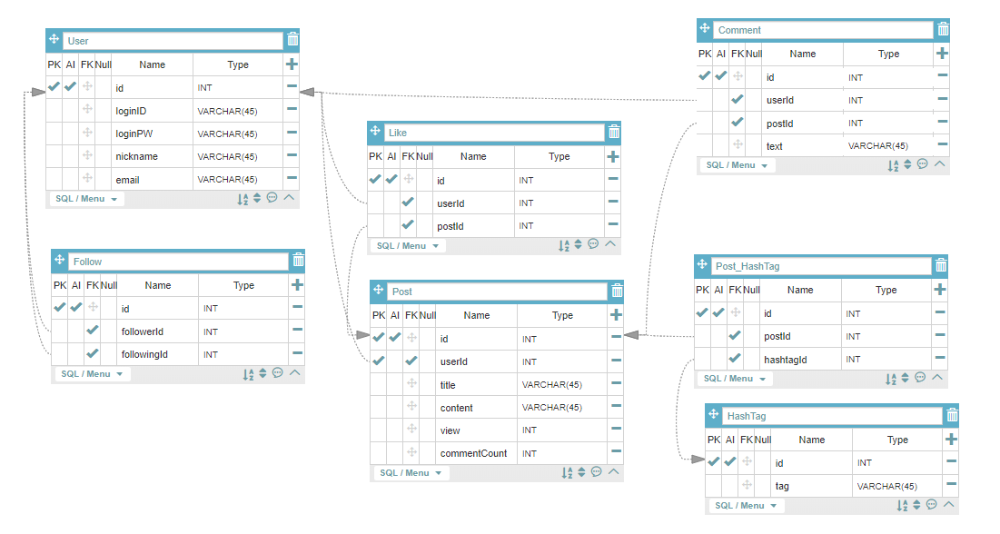

# API_Blog

### 기술 스택
- 백엔드
  - Node.js
  - Express
  - MySQL, REST API
- 테스트 
  - Mocha, Should.js, SuperTest

### 기능
- 회원관리
- 게시글 CRUD
- 댓글 CRUD
- 해시태그
- 구독
- 좋아요

### 기본 기능 구현
- 회원관리
    - [ ] 로그인 / 로그아웃
    - [x] 회원가입
    - [x] 조회
    - [x] 수정
    - [x] 탈퇴
    - [ ] 구독
- 게시글
    - [x] 조회
    - [x] 생성
    - [x] 수정
    - [x] 삭제
    - [ ] 해시태그
    - [ ] 좋아요
- 댓글
    - [x] 조회
    - [x] 생성
    - [x] 수정
    - [x] 삭제

### 추가 기능 구현
- 회원관리
    - [ ] 회원 등급
    - [ ] 핸드폰 인증 API
    - [ ] 비밀번호 암호화 ( bcrypt )
    - [ ] 회원 이미지 ( multer )
- 게시글
    - [ ] 에디터 사용 ( CKEditor )
    - [ ] 검색
    - [ ] 정렬 ( 조회수, 좋아요, 최신 )
    - [ ] 페이징
- 구독
    - [ ] 새 게시글 알람 ( API )

### DB

[DB Table](https://aquerytool.com/aquerymain/index/?rurl=92fd13a3-cdd7-4beb-881e-4413e9aeda33)
- PW : oz35vx 